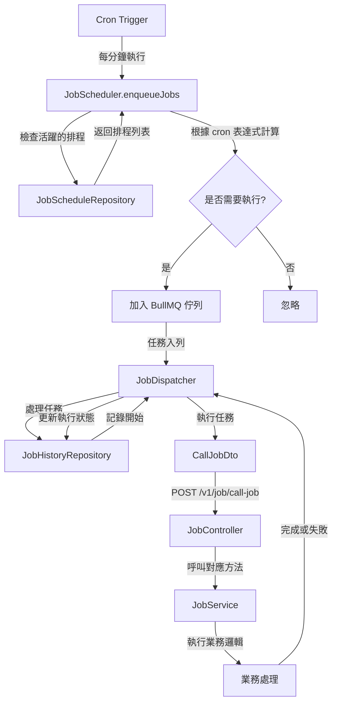
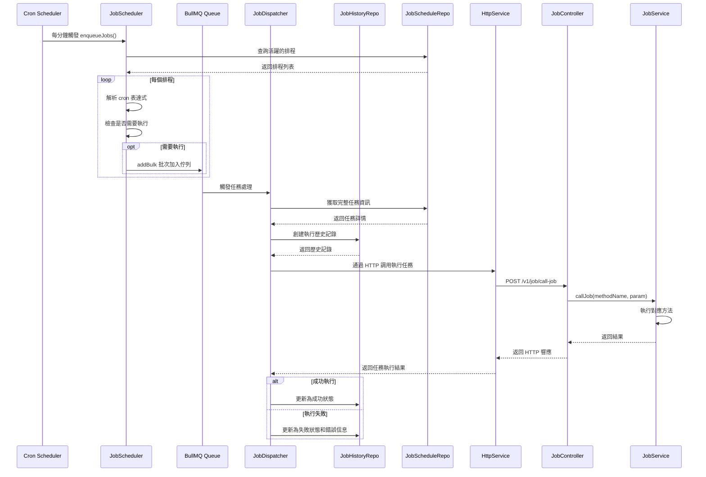
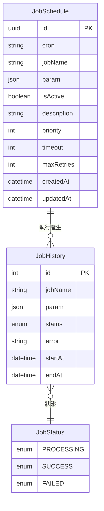

# 排程系統 (Job Scheduling System)

## 系統介紹

排程系統是基於 NestJS 框架的一個可靠、高效的任務排程模組，利用 BullMQ 進行任務佇列管理。此系統提供了定時執行任務、任務管理、執行歷史追蹤等功能，支援 cron 表達式來定義任務執行的時間間隔。

### 系統組件

- **JobScheduler**: 負責定期檢查排程任務並將符合執行條件的任務加入佇列
- **JobDispatcher**: 負責從佇列取出任務並執行，記錄執行歷史
- **JobService**: 包含實際業務邏輯實現的方法
- **JobController**: 提供 API 端點用於手動觸發任務
- **JobScheduleRepository/JobHistoryRepository**: 處理資料存取

### 主要功能

- **排程任務定義**：使用 cron 表達式設定任務執行時間
- **任務優先級**：支援設定任務的優先順序
- **失敗重試機制**：可設定任務失敗後的重試次數和策略
- **任務超時控制**：支援設定任務的最大執行時間
- **執行歷史記錄**：追蹤每個任務的執行情況、開始時間、結束時間及錯誤信息
- **動態啟用/停用**：可靈活控制任務的啟用狀態

## 系統架構

### 流程圖



### 時序圖



## 資料表結構 (ERD)



## 使用方式

### 1. 創建排程任務

在 `JobSchedule` 資料表中添加新的排程任務：

```typescript
// 例如，添加一個每天午夜執行的資料清理任務
await jobScheduleRepository.db.jobSchedule.create({
  data: {
    cron: '0 0 * * *', // 每天午夜執行
    jobName: 'processData', // 要執行的方法名稱
    param: ['param1', 'param2'], // 參數
    isActive: true,
    description: '每日資料清理任務',
    priority: 10, // 優先級
    timeout: 600000, // 10分鐘超時
    maxRetries: 3 // 最大重試次數
  }
});
```

### 2. 創建任務處理邏輯

在 `JobService` 中添加與 `jobName` 對應的方法：

```typescript
// 在 JobService 中
async processData(param: string[], user: ReqUser): Promise<void> {
  this.logger.log(`Processing data with params: ${param?.join(', ')}`);
  
  // 實現資料處理邏輯
  await this.dataService.cleanupData();
  
  this.logger.log('Data processing completed successfully');
}
```

### 3. 手動觸發任務

通過 API 端點手動觸發任務：

```typescript
// POST /v1/job/call-job
{
  "methodName": "processData",
  "param": ["param1", "param2"]
}
```

## 注意事項

1. 所有任務方法都必須在 `JobService` 中實現
2. 任務執行不應超過設定的超時時間
3. 重要任務應設定適當的重試次數
4. 建議定期清理 `JobHistory` 表以避免資料過大
5. 高優先級的任務會優先執行，應適當設定優先級

## 進階設定

- **並發控制**：可通過 BullMQ 的設定控制並行處理任務的數量
- **記憶體監控**：在處理大量資料的任務中應監控記憶體使用情況
- **分佈式部署**：BullMQ 支援分佈式環境，可擴展到多節點部署
