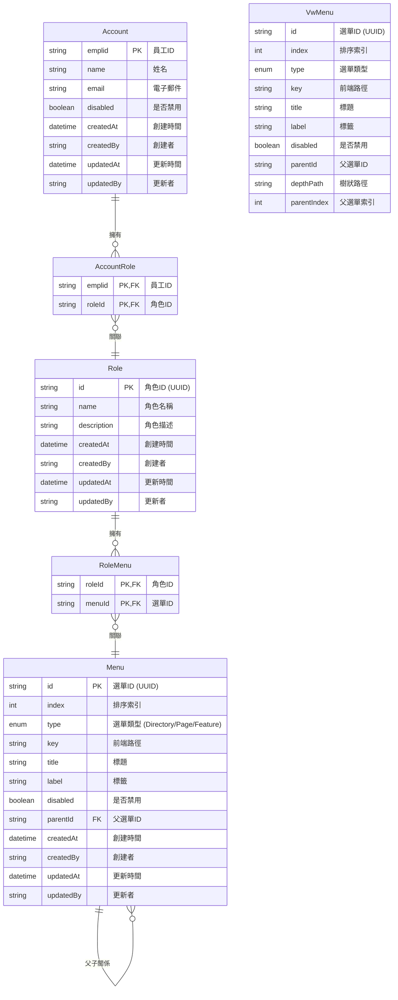

# 權限管理模組 (Permission Module)

本模組提供完整的權限管理功能，包括角色管理、選單權限配置以及使用者-角色關聯管理。

## 功能概述

- **角色管理**: 創建、編輯、刪除角色
- **選單權限配置**: 為角色分配選單權限
- **使用者-角色關聯**: 管理使用者與角色的對應關係
- **權限樹**: 使用遞迴查詢建立的選單樹結構

## API 端點

| 方法   | 路徑                    | 描述                       |
|------|------------------------|--------------------------|
| GET  | /v1/permission/auth-menu | 獲取當前使用者的授權選單       |
| GET  | /v1/permission/role/menu | 獲取角色的選單權限            |
| POST | /v1/permission/person/search | 搜尋人員列表               |
| POST | /v1/permission/person    | 新增人員                    |
| PUT  | /v1/permission/person    | 編輯人員                    |
| POST | /v1/permission/role/search | 搜尋角色列表               |
| POST | /v1/permission/role      | 新增角色                    |
| PUT  | /v1/permission/role      | 編輯角色                    |
| DELETE | /v1/permission/role/:id | 刪除角色                    |

## 資料庫結構 (ERD)

以下是權限模組相關的資料庫實體關係圖:



## 資料表說明

### Account (公共結構)

使用者帳號表，存儲基本的使用者資訊。

### Role (權限結構)

角色定義表，用於定義系統中的角色及其描述。

### Menu (權限結構)

選單表，定義系統中的選單項目，支援多層級樹狀結構。

### AccountRole (權限結構)

使用者-角色關聯表，定義使用者和角色之間的多對多關係。

### RoleMenu (權限結構)

角色-選單關聯表，定義角色和選單之間的多對多關係，用於控制角色的選單權限。

### VwMenu (視圖)

選單的遞迴視圖，通過 WITH RECURSIVE 查詢生成樹狀結構的選單，方便前端渲染。

## 重要設計特點

1. **多層級選單結構**: 通過 `parentId` 實現選單的樹狀結構
2. **選單類型區分**: 選單區分為目錄(Directory)、頁面(Page)和功能(Feature)三種類型
3. **角色基礎權限控制**: 通過角色-選單關聯實現基於角色的權限控制
4. **遞迴查詢**: 使用 PostgreSQL 的 WITH RECURSIVE 實現高效的樹狀結構查詢

## 使用範例

### 獲取使用者授權選單

```typescript
// 前端調用
const authMenu = await api.get('/v1/permission/auth-menu');
```

### 為角色分配選單權限

```typescript
// 前端調用
await api.put('/v1/permission/role', {
  id: roleId,
  name: 'Admin',
  description: '管理員角色',
  menuIds: ['menu-id-1', 'menu-id-2', 'menu-id-3']
});
```

## 注意事項

1. 選單的 `key` 字段對應前端路由路徑
2. 遞迴視圖 `VwMenu` 提供了 `depthPath` 以表示選單的層級路徑，便於排序和顯示
3. 刪除角色或選單時會級聯刪除相關的關聯記錄
